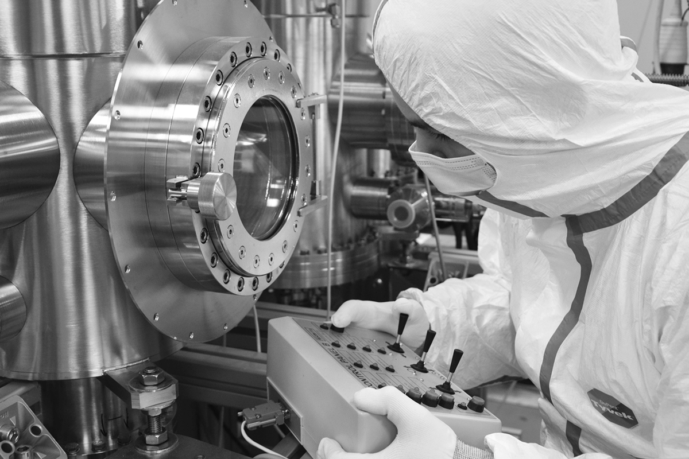

  

<h1 align="center">Welcome to SemiTEq</h1>

  <strong>Pioneering High-Vacuum & Ultra-High Vacuum Solutions for the Electronics Industry</strong>

 

  <a href="https://semiteq.org/about_us/about/" target="_blank">
    <!-- About Us: simple info icon -->
    
  </a>
  <a href="https://semiteq.org/application_lab/" target="_blank">
    <!-- Application Lab: simple test tube icon -->
    
  </a>
  <a href="https://semiteq.org/service/" target="_blank">
    <!-- Service & Support: simplified gear icon -->
    
  </a>
  <a href="https://semiteq.org/contacts/" target="_blank">
    <!-- Contact Us: simple envelope icon -->
    
  </a>

 

  SemiTEq is a leading manufacturer specializing in <strong>high-vacuum (HV)</strong> and <strong>ultra-high vacuum (UHV)</strong> technological equipment. With over two decades of experience, we engineer and deliver comprehensive solutions – from initial R&D concepts to the full-scale production of advanced systems for the demanding electronics and semiconductor industries. We pride ourselves on innovation driven by our own scientific research and patented technologies.

<h2> Core Technologies & Systems</h2>

Our expertise spans critical areas of semiconductor manufacturing and research:

*   ⚛️ **Molecular Beam Epitaxy (MBE) Systems:** Precision-engineered MBE systems for diverse research and production needs.
    *   _Universal Compact MBE (e.g., STE75):_ Flexible R&D platforms.
    *   _High-Temperature III-Nitride MBE (e.g., STE3N Series):_ Optimized for nitride materials growth.
    *   _A3B5 Material Growth MBE (e.g., STE35):_ High-quality compound semiconductor deposition.
    *   _Advanced Technological Platforms (e.g., STE35R1):_ Integrated solutions for thin film research.

*   ⚙️ **Wafer Processing Equipment:** A comprehensive suite of tools supporting various steps in semiconductor wafer fabrication.

*   🔥 **Rapid Thermal Annealing (RTA) Systems:** High-speed wafer annealing solutions for critical process steps (e.g., STE RTA100).

*   ⚡ **Plasma Etching & Deposition Systems:** Advanced plasma technology for precise material modification.
    *   _Reactive Ion Etching (RIE) (e.g., STE RIE200):_ Anisotropic etching capabilities.
    *   _Inductively Coupled Plasma (ICP) Etching (e.g., STE ICP200E):_ High-density plasma for advanced etching processes.
    *   _Plasma Enhanced Chemical Vapor Deposition (PECVD) (e.g., STE PECVD200, STE ICP200D):_ Controlled thin film deposition.
 

  
   <em>Molecular Beam Epitaxy, Electron beam etching system and Advanced Plasma Etching System by SemiTEq</em>

<h2> Application Laboratory & Support</h2>

  
   <em>MBE System by SemiTEq</em>

*   🧪 **State-of-the-Art Application Lab:** Our dedicated lab focuses on developing key technological processes, rigorously testing and demonstrating equipment capabilities, and validating performance characteristics. Our experts collaborate with clients to define optimal system configurations tailored to specific research or production goals.
*   🛠️ **Comprehensive Service & Support:** We are committed to the long-term success of our customers. SemiTEq provides extensive service, maintenance, and technical support for all our equipment, ensuring maximum uptime and operational excellence.

<h2> Explore More & Connect</h2>

Stay informed about our latest innovations, news, and industry insights. Follow us!
 
  Discover the full range of SemiTEq's capabilities and detailed product specifications on our official website:
    
  
  <a href="https://semiteq.org/contacts/" target="_blank">
    <!-- Contact Us: simple envelope icon -->
    
  </a>

 

  

  <small>Copyright © 2012—2025 SemiTEq JSC. All rights reserved.</small>

